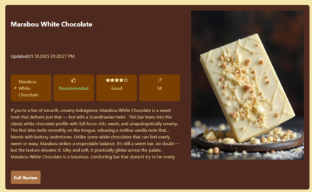
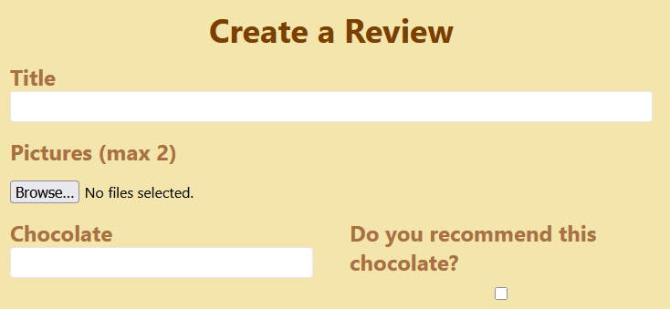

# Chocolate-Review

## Overview
Chocolate-Review is a full-stack web application where users can register and write reviews for their favorite chocolates.
Finding reviews created by other users is easy with many filtering and sorting options. Users can also comment on reviews made by other users 
to give feedback or just to say hello.

Built with TypeScript, React, Express, MongoDB, Playwright for writing tests.

## Deployment
The application is deployed and running live on [Render hosting service](https://chocolate-review-joakha.onrender.com)

## Application Screenshots

  
  
  

## Features
- **Register and Login**: An account can be registered with email and password. A JWT token stored in a HTTP cookie is used to authenticate the user.
- **Finding reviews**: Users can find reviews created by others using many filters and sorting option
- **Review Creation**: Users can create, edit and delete their own reviews.
- **Review Comments**: Logged in users can comment on reviews created by others.
- **Pagination**: Queries for finding reviews and comments are paginated to stop the interface from being cluttered.

## Testing:

Tests for the application were written using the Playwright framework.

Testing covers the following ue cases:

- Registration and logging in

- Finding reviews

- Review creation and editing

- Users reviews are displayed on their page

## Dependencies

### Frontend:

- TanStack Query: Used for helpful async data management.

- React Hook Form: Easy validation for form creation.

- React Icons: Icons for styling.

- React DatePicker: Simple datepicker.

### Backend:

- bcrypt: Hash account passwords so theyre not saved as plain text in the database.

- cookie-parser: Read cookies and access them  easily in Express.

- cors: Enable and configure CORS in Express.

- cross-env: Use separate .env files for development and testing.

- jsonwebtoken: Add JWT implementation to Express.
